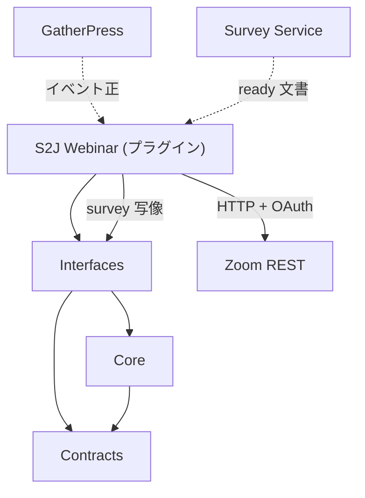

<!--
目的：「フォルダー構成、主要ファイル、技術スタック、責務」の明文化
-->

# S2J Webinar Service - アーキテクチャー

## 設計意図 (ゴール)

Webinar の検証・操作計画・リクエスト材料・写像を、WordPress と HTTP 実行から切り離し、PHPUnit だけで回帰できるようにします。

## 設計方針

* FOP + Clean Coding を基本とする。Clean Architecture の定型分割は採用しない。
* コアは、純粋関数と不変レコードに閉じる。
* HTTP の実行、トークン保存、画面はライブラリの外である。
* プロバイダは記述子レジストリで差し替える ([provider_spec.md](./core/provider_spec.md))。初版は `zoom` のみ。使わない接続先の空実装は置かない。

## レイヤー構成

| 層 | 責務 | 非責務 |
| --- | --- | --- |
| Contracts | レコード・リクエスト・結果の形 | 検証・差分の本体 |
| Core | 検証、操作計画、Panelist 差分、リクエスト材料、応答写像、survey 写像、OAuth 材料 | I/O、HTTP 実行 |
| Interfaces | 公開関数の入口 | ドメイン規則の重複実装 |



## フォルダー構成 (想定)

**公開面は、名前空間の関数だけ** です。正本は [php_api_spec.md](./interfaces/php_api_spec.md) です。`Core\*.php` は内部実装であり、呼び出し側は直接使いません。

本ライブラリに **`adapters/http/` は置きません。** HTTP 実行はプラグイン (HTTP Adapter)。記述子上の Adapter 関数とは別物です ([contracts/data_dictionary.md](./contracts/data_dictionary.md))。ライブラリ SoT は、上記の純関数構成です。

Zoom 固有のパス・ボディ・OAuth スコープ・survey / 結果写像は **`Core/Providers/` 配下の記述子** に置きます。`Core/Request.php` 等に Zoom 文字列をハードコードしません (ディスパッチと薄い委譲のみ)。

```plaintext
s2j-webinar-service/
├── README.md
├── LICENSE
├── composer.json
├── phpunit.xml
├── phpstan.neon
├── phpcs.xml.dist
├── package.json
├── docs/                 # 確定仕様 (本ディレクトリ)
├── docs_mod/             # 改訂案・進行中イニシアチブの起草
├── coverage/             # PHPUnit 生成物 (gitignore)
├┬─ src/
│├── Contracts/
│├┬─ Core/
││├─ Record.php
││├─ Validate.php
││├─ Provider.php      # レジストリ (記述子 lookup)
││├─ Operation.php
││├─ Panelist.php
││├─ Request.php         # レジストリ経由の委譲 (Zoom パスは置かない)
││├─ Result.php
││├─ Oauth.php
││└─ Providers/          # zoom: path/body/写像の正本実装 (空実装は置かない)
│└── …                     # 公開関数 (名前空間 S2J\WebinarService\)
└┬─ tests/
　├─ Unit/
　└─ bootstrap.php
```

## 技術スタック

| 項目 | 方針 |
| --- | --- |
| PHP | v8.1以上 |
| テスト | PHPUnit (WordPress なし、Zoom ライブなし) |
| 静的解析 | PHPStan |
| スタイル | PHPCS (PSR-12を基本) |
| ドキュメント lint | `@s2j/docs-linter` / `npm run lint:docs` |
| 配布 | Packagist (`s2j/webinar-service`) |

## プラグインとの境界

| 置き場 | 中身 |
| --- | --- |
| 本ライブラリ | 計算 (検証・計画・材料・写像) |
| S2J Webinar | OAuth、HTTP、メタ、画面 |
| GatherPress | イベント UI |
| Survey Service | 設問の検査・助言 |

## 関連

* 原則: [principles.md](./principles.md)
* プロバイダ・レジストリ: [core/provider_spec.md](./core/provider_spec.md)
* 公開面: [interfaces/php_api_spec.md](./interfaces/php_api_spec.md)
