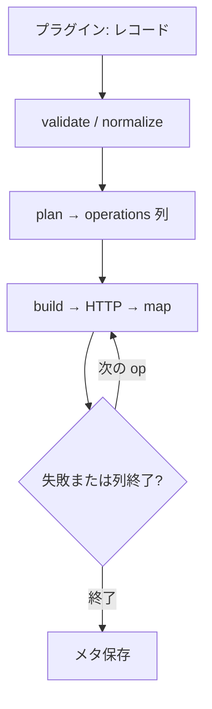
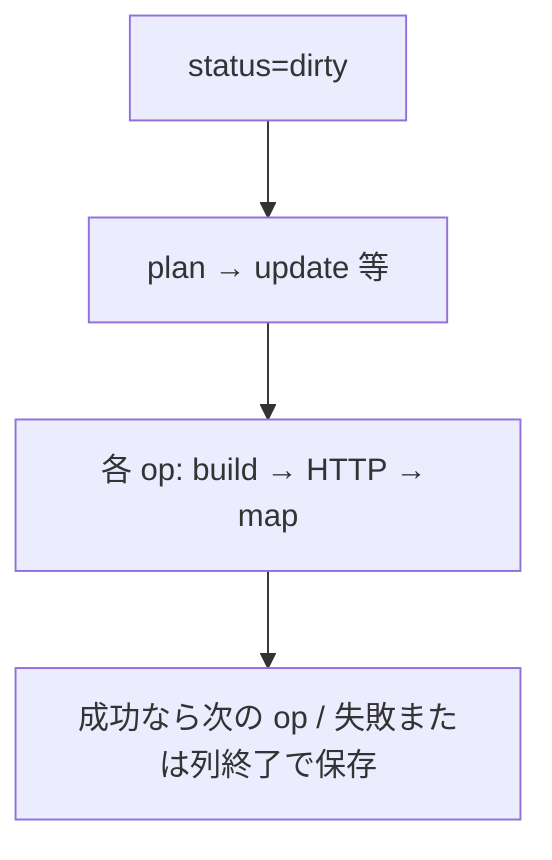

<!--
目的：「想定ユースケース、解決する課題、処理フロー」の明文化
-->

# S2J Webinar Service - コンセプト

## 前提条件

* イベントの正は GatherPress のイベントである。
* Zoom への HTTP とトークン保存は S2J Webinar プラグインが行う。
* ホストは、OAuth で接続した Webinar 権限のある Zoom ユーザーである (WordPress 管理者とは別人でよい)。
* 設問の良し悪しは Survey Service が判定する。本ライブラリは写像だけを持つ。

## 解決する課題

Zoom Webinar の作成を管理画面と手作業で繰り返している状態を、イベント編集から一方向に送れるようにします。判断 (検証・差分・リクエスト形) を WordPress の外に出し、PHPUnit だけで回帰できるようにします。

## ユースケース

| 場面 | 利用者 | 本ライブラリの役割 |
| --- | --- | --- |
| イベントから Webinar を新規登録する | 運営者 (経由: プラグイン) | 検証 → 1回の計画列 (`create` 等) → 各材料と応答写像 |
| 項目変更後に Zoom に送る | 同上 | `dirty` の場合だけ `update` 材料 |
| 登壇者の追加・削除 | 同上 | メール基準の差分とリクエスト材料 (`synced` のままでよい) |
| 「Zoom で開く」 | 同上 | `get` → `map_webinar_response` の揮発 `start_url` をその場で開く (保存しない) |
| アンケートを付ける | 同上 | `ready` 文書があれば計画に `attach_survey` (create と同時でも、後からだけでも同じ入口) |

## 処理フロー

### 新規登録 (単一計画の骨格)

作成応答の `id` がウェビナー ID です。発行の webhook は待ちません。追加が失敗しても Webinar は削除しません。`plan` は1回でよく、返す列を順に実行します。**ある op が失敗したら、残りの op は送らず終了**します。

実行順の例: `create` → `add_panelists` → `attach_survey` (計画に含まれるものだけ)。正本は [operation_spec.md](./core/operation_spec.md) と [usage_spec.md](./interfaces/usage_spec.md)。

### 更新

## 責務分離

| 層 | 役割 |
| --- | --- |
| 本ライブラリ | 検証、操作計画、リクエスト材料、差分、応答写像、survey 写像、OAuth 材料 |
| S2J Webinar | OAuth、HTTP、GatherPress メタ、管理画面 |
| GatherPress | イベント UI ・日時・公開 URL |
| Survey Service | 設問の検査・助言 |

## 関連

* 概要: [overview.md](./overview.md)
* 使用方法: [interfaces/usage_spec.md](./interfaces/usage_spec.md)
