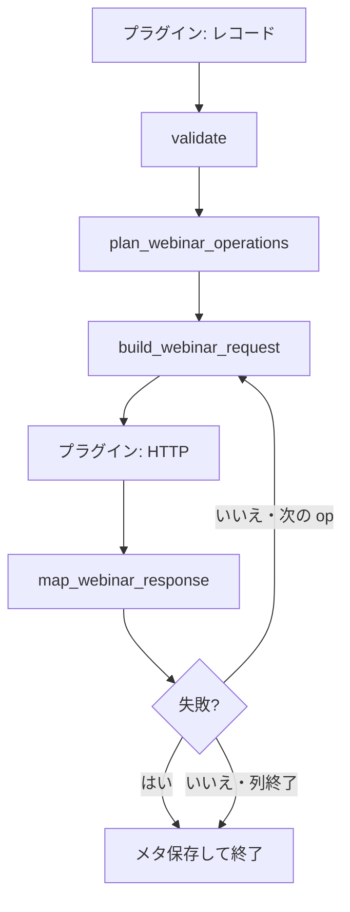

<!--
目的：「使用方法」の明文化
-->

# S2J Webinar Service - 使用方法

## 設計意図 (ゴール)

内部実装を意識せず、プラグインが検証・操作計画・リクエスト材料・応答写像を呼べるようにします。HTTP とトークン保存のタイミングの正本は [S2J Webinar](https://github.com/stein2nd/s2j-webinar) の仕様です。

Survey 添付も同じパイプラインです (`plan` → `attach_survey` → `build_webinar_request`)。survey 未完了を create の条件にせず、ready 文書がそろった時点で同じ入口から付けます。

## 非対象

* プラグインのパネル HTML
* OAuth トークンの永続化手順
* GatherPress / WordPress のメタキー名と、メタ ↔ WebinarRecord の対応 (プラグイン仕様)

## インストール

Packagist のパッケージ名だけを require します。`repositories` に `VCS` / `path` は書きません。

```bash
composer require s2j/webinar-service
```

## 新規登録の骨格

```php
use function S2J\WebinarService\validate_webinar_record;
use function S2J\WebinarService\plan_webinar_operations;
use function S2J\WebinarService\build_webinar_request;
use function S2J\WebinarService\map_webinar_response;

$validated = validate_webinar_record( $record );
if ( [] !== $validated['deficiencies'] ) {
	// 適切なメッセージ文を表示 (i18n)。Zoom には送らない
	return;
}

$ops = plan_webinar_operations( $validated['record'], [
	'previous_panelists' => $previous,
	'survey_document'    => $ready_survey, // 任意。非空なら attach_survey を計画に含める
	'webinar_title'      => $topic,
] );

foreach ( $ops as $step ) {
	$built = build_webinar_request( $step['op'], $validated['record'], $step );
	if ( [] !== $built['deficiencies'] ) {
		// 不足 (未知 provider 等)。HTTP せず終了
		return;
	}
	$req = $built['material'];
	// プラグインが Authorization を付けて HTTP
	$mapped = map_webinar_response( $step['op'], $status, $body, $validated['record'] );
	if ( [] !== $mapped['deficiencies'] ) {
		return;
	}
	$validated['record'] = $mapped['record'];
	// 写像後に status が error なら残りの op は送らない
	// (書き込み失敗は map が error にする。get 失敗は status を変えないが、get は列末尾)
	if ( 'error' === $mapped['record']['status'] ) {
		break;
	}
}
// プラグインが $validated['record'] をメタに保存
```

## 後からアンケートだけ付ける

ウェビナーがすでにあり (`synced`)、設問が後から `ready` になった場合:

```php
$ops = plan_webinar_operations( $record, [
	'survey_document' => $ready_survey,
	'webinar_title'   => $topic,
] );
// → [ { 'op' => 'attach_survey', 'survey_document' => …, 'webinar_title' => … } ] を想定
// build は $step だけで足りる (plan 時 context を持ち回さない)
```

## 「Zoom で開く」

```php
$ops = plan_webinar_operations( $record, [ 'intend_get' => true ] );
// または直接:
$built = build_webinar_request( 'get', $record, [] );
// $built['deficiencies'] が空なら $built['material'] で HTTP
$mapped = map_webinar_response( 'get', $status, $body, $record );
// $mapped['start_url'] をその場で開く。保存しない。status は変えない
```

## 処理フロー



## 関連

* PHP API: [php_api_spec.md](./php_api_spec.md)
* プラグイン仕様: [S2J Webinar specs](https://github.com/stein2nd/s2j-webinar/blob/main/docs_mod/specs.md) (プラグイン側が `docs/` に移行したら追随する)
