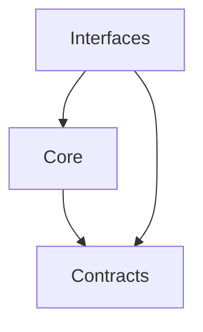

<!--
設計原則
-->

# S2J Webinar Service - 設計原則

## 原則

### 1. Source of Truth

* 規則の正本は、`docs_mod/core/` (合意後は `docs/core/`) である。
* 型とフィールドの正本は、`contracts/` である。
* README は最短手順であり、契約と矛盾させない。

### 2. 純関数

* Core は、グローバル状態、ネットワーク、ファイルシステムに依存しない。
* 「今」が必要な場合は、呼び出し側が時刻を引数で渡す (初版の操作計画は主に渡された `status` とレコード内容で足りる)。
* `dirty` / `synced` の判定は呼び出し側。ライブラリは受け取った `status` を推測し直さない。
* 同じ入力には、同じ操作計画・同じリクエスト材料を返す。

### 3. 依存方向

* Core は、WordPress / HTTP 実行 / Zoom SDK / GatherPress を知らない。
* OAuth のクライアント ID / シークレットは、ライブラリに埋め込まない。

### 4. 責務分離

| 層 | 責務 |
| --- | --- |
| Core | 規則 |
| Contracts | 形 |
| Interfaces | 入口 |
| プラグイン | I/O、トークン、画面、**メタキーとレコードの対応** |

本ライブラリの仕様に WordPress / GatherPress のメタキー名を書かない。

### 5. 一方向同期

* WordPress → Zoom が正である。
* Zoom 側の手修正を検知して WordPress に戻さない (初版)。
* 再取得 (`get`) は表示用であり、イベントのタイトルや日時を上書きせず、レコードの `status` も変えない。

### 6. プロバイダ

* プロバイダは **記述子 + Adapter 関数のレジストリ** で差し替える。共通はレコードと操作の骨格、差分は記述子の写像に閉じる。正本は [core/provider_spec.md](./core/provider_spec.md) (Slug Generater の翻訳プロバイダに倣う。OpenAPI codegen は持たない)。
* 公開関数はレジストリを引く薄いファサードである。Zoom 専用分岐を公開面に置かない。
* 初版の実装は `zoom` だけである。使わない接続先の空実装は置かない。
* 未知の `provider` は不足 `provider_unsupported` とする。例外にしない。
* **例外**はプログラマー／設定ミスだけとする: 未知の `op`、計画 op の必須 step 欠落 (例: `attach_survey` の `survey_document`)、id 非空前提 op で `webinar_id` 空、OAuth 必須 config 欠落。
* 管理画面での選択は呼び出し側 (プラグイン) の責務である。実装済みプロバイダが増えた場合に出す。
* 「HTTP Adapter」(プラグインの HTTP 実行) と、記述子上の Adapter 関数は別物である。

### 7. 設問は外

* 設問の検査・助言は、Survey Service である。
* 本ライブラリは、Zoom アンケートへの写像だけを持つ。公開入口は `attach_survey` (survey 未完了を create の条件にしない)。

## 借用する原則

[kis-wordpress エコシステム仕様](https://github.com/stein2nd/kis-wordpress/blob/main/docs_mod/specs.md) と同様です。

| 原則 | 本ライブラリでの意味 |
| --- | --- |
| 依存の向きは外 → 内 | 純関数は WP / GatherPress / HTTP / Zoom SDK を知らない |
| 内側はビジネスルール | 検証、操作計画、Panelist 差分、写像 |
| 外側は詳細 | プラグインが OAuth、HTTP、画面を持つ |
