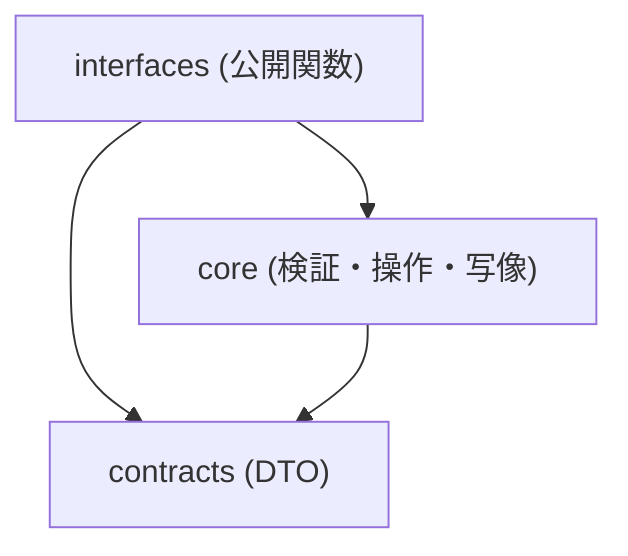

# S2J Webinar Service - 仕様書の起点

本プロジェクトの仕様は、下記のドキュメントに分散して定義します。
各ドキュメントへの導線のみを提供し、詳細な仕様は個別ファイルに委譲します。

統合の見取り図は [service_spec.md](./service_spec.md) です (要約。規則の正本は `core/`)。構成は [S2J Similarity Service の docs/](https://github.com/stein2nd/s2j-similarity-service/tree/main/docs) と [S2J Webinar Survey Service の docs/](https://github.com/stein2nd/s2j-webinar-survey-service/tree/main/docs) に倣い、本ライブラリに必要な層だけを置いています。

**いまの置き場:** 合意前のため本キットは `docs_mod/` にあります。合意後は `docs/` に移し、以降の大きな改訂案だけを `docs_mod/` で起草します。

## 読み方ガイド

本ドキュメント群は、「Why → What → How → Usage → Operations」の順で理解することを前提とします。

### 推奨読み順 (初読)

1. **[concept.md](./concept.md)** — なぜ存在するか
2. **[contracts/](./contracts/data_contract_spec.md)** — 入出力契約
3. **[architecture.md](./architecture.md)** — レイヤと依存
4. **[core/](./core/record_spec.md)** — レコード・検証・操作・写像
5. **[interfaces/](./interfaces/usage_spec.md)** — 呼び出し方
6. **[engineering/](./engineering/ci.md)** — CI と配布

### 役割別読み順

#### 呼び出し側 (S2J Webinar プラグイン)

1. [interfaces/usage_spec.md](./interfaces/usage_spec.md)
2. [interfaces/php_api_spec.md](./interfaces/php_api_spec.md)
3. [contracts/data_contract_spec.md](./contracts/data_contract_spec.md)

#### 実装者 (本ライブラリ)

1. [architecture.md](./architecture.md)
2. [contracts/](./contracts/data_contract_spec.md)
3. [core/](./core/record_spec.md)
4. [testing.md](./testing.md)
5. [governance/documentation_governance.md](./governance/documentation_governance.md)

## ドキュメント一覧

### Why (基本情報)

| ドキュメント | 内容 |
| --- | --- |
| [概要](./overview.md) | プロジェクト概要、責務、非対応 |
| [コンセプト](./concept.md) | 背景、課題、ユースケース、処理フロー |
| [アーキテクチャー](./architecture.md) | レイヤ、フォルダー、依存方向 |
| [設計原則](./principles.md) | Source of Truth、純関数、境界 |
| [統合見取り図](./service_spec.md) | サービス全体の要約。規則の正本は `core/` |

### Domain (コア)

| ドキュメント | 内容 |
| --- | --- |
| [レコード](./core/record_spec.md) | Webinar レコードの形と `status` |
| [検証](./core/validation_spec.md) | 項目の検証と不足コード |
| [プロバイダ・レジストリ](./core/provider_spec.md) | 記述子 + 写像。初版は `zoom` のみ |
| [操作計画](./core/operation_spec.md) | 次の操作 (`create` / `update` 等) |
| [Panelist](./core/panelist_spec.md) | 登壇者差分 (追加・削除) |
| [リクエスト材料](./core/request_spec.md) | メソッド・パス・ボディ (Authorization なし) |
| [結果写像](./core/result_spec.md) | API 応答からレコードへの写像 |
| [OAuth 材料](./core/oauth_spec.md) | 認可・トークン交換のリクエスト材料 |
| [アンケート写像](./core/survey_map_spec.md) | Survey 文書 → Zoom survey PATCH |

### What (契約)

| ドキュメント | 内容 |
| --- | --- |
| [入出力仕様](./contracts/data_contract_spec.md) | DTO、結果レコード |
| [データ辞書](./contracts/data_dictionary.md) | 用語、型、制約 |

### How (インターフェイス)

| ドキュメント | 内容 |
| --- | --- |
| [PHP 公開面](./interfaces/php_api_spec.md) | Composer から見える関数・型 |
| [使用方法](./interfaces/usage_spec.md) | プラグインからの呼び出し例 |

### エンジニアリング

| ドキュメント | 内容 |
| --- | --- |
| [CI](./engineering/ci.md) | 品質ゲート |
| [ビルドおよびリリース](./engineering/build_and_release.md) | Packagist、セマンティックバージョン |

### ガバナンス

| ドキュメント | 内容 |
| --- | --- |
| [ドキュメンテーション](./governance/documentation_governance.md) | README と docs の整合、用語、イニシアチブ証跡 |
| [archive 索引](./archive/README.md) | 完了した実装・改修イニシアチブの凍結一覧 |

### その他

| ドキュメント | 内容 |
| --- | --- |
| [テスト戦略](./testing.md) | テストレベル、`/coverage/`、必須分岐 |
| [実装状況](./status.md) | 機能単位の進捗 (製品全体の「いま」) |

## 本ライブラリに置かない層

Similarity Service にあるが、初版の本ライブラリでは持たないものです。

| Similarity 側 | 本ライブラリ |
| --- | --- |
| OpenAPI / codegen / TS SDK | なし。契約は PHP の DTO と本 docs。プロバイダ追加も記述子1件 ([provider_spec.md](./core/provider_spec.md)) |
| REST / WordPress HTTP Adapter | なし。HTTP の実行はプラグイン |
| Embedding / 外部モデル呼び出し | なし |
| SRE (観測・スケール) | なし。インプロセスの純関数 |
| 認証・課金ガバナンス | なし。OAuth トークンはプラグインが保存 |

設問の検査・助言は [S2J Webinar Survey Service](https://github.com/stein2nd/s2j-webinar-survey-service) です。本ライブラリは `ready` 文書を Zoom アンケート PATCH の材料に写すだけです。

## 依存関係ルール

### 禁止事項

* Core が WordPress / HTTP 実行 / Zoom SDK / GatherPress を知らない。
* Contracts にビジネス規則 (検証・差分の本体) を置かない。
* Interfaces にドメイン規則を埋め込まない (薄い入口にする)。

## Source of Truth (SoT)

| 対象 | 正本 |
| --- | --- |
| Webinar レコード・検証・操作・写像の規則 | [core/](./core/record_spec.md) |
| 入出力の型とフィールド | [contracts/data_contract_spec.md](./contracts/data_contract_spec.md) |
| 用語の意味 | [contracts/data_dictionary.md](./contracts/data_dictionary.md) |
| 公開 PHP API | [interfaces/php_api_spec.md](./interfaces/php_api_spec.md) |
| ユーザー向け最短手順 | ルート [README.md](../README.md) と [usage_spec.md](./interfaces/usage_spec.md) |

契約と README が食い違う場合は、core / contracts を正とし、README を追随させます。

## 補足

* 各仕様は「責務・非責務」で境界を定義する。
* 新規仕様は、必ず既存レイヤーに分類する。分類できない場合は、新規レイヤーを足さず、再設計する。
